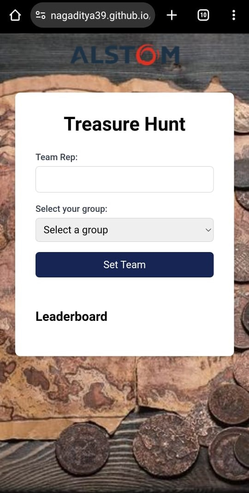

# 🖥️ Scavenger Hunt Backend

<div align="center">




[](https://nodejs.org/)
[](https://expressjs.com/)
[](https://www.mongodb.com/)

The powerful backend serving the Scavenger Hunt application.

[Features](#-features) • [Setup](#%EF%B8%8F-setup-and-installation) • [API Endpoints](#%EF%B8%8F-api-endpoints) • [Deployment](#-deployment) • [Scripts](#-scripts) • [Contributing](#-contributing)

</div>

This is the backend repository for the Scavenger Hunt application. For the frontend code, please visit the [Scavenger Hunt Frontend Repository](https://github.com/nagaditya39/scavenger_hunt).

## 🌟 Features

- 📊 Team progress tracking
- 🔐 Code validation
- 🌐 Public progress API
- 🏆 Team position calculation
- 🔒 Secure CORS configuration
- 🔄 Data migration and cleanup scripts

## 🛠️ Setup and Installation

1. **Clone the repository**

   ```bash
   git clone https://github.com/nagaditya39/scavenger_hunt_backend.git
   cd scavenger_hunt_backend
   ```

2. **Install dependencies**

   ```bash
   npm install
   ```

3. **Environment Configuration**

   Create a `.env` file in the root directory:

   ```env
   PORT=3000
   MONGODB_URI=your_mongodb_connection_string
   ```

4. **Start the server**

   ```bash
   node server.js
   ```

   The server will start running on `http://localhost:3000`.

## 🔗 API Endpoints

| Method | Endpoint | Description |
|--------|----------|-------------|
| POST | `/api/check-code` | Validate a submitted code |
| GET | `/api/public-progress` | Retrieve public progress for all teams |
| GET | `/api/team-progress/:teamName/:group` | Get progress for a specific team |
| GET | `/api/team-position/:teamName/:group` | Get the position of a team that has completed all clues |

## 📊 Database Schema

The application uses a MongoDB database with the following `Team` schema:

```javascript
const teamSchema = new mongoose.Schema({
  name: String,
  group: String,
  progress: [{
    clueNumber: Number,
    code: String,
    content: String,
    found: Boolean,
    timestamp: { type: Date, default: Date.now }
  }],
  version: { type: Number, default: 0 }
}, {versionKey: false});
```

## 🚀 Deployment

This backend can be deployed to various online platforms. Here's a general guide for deployment:

1. **Prepare your application**
   - Ensure all dependencies are in `package.json`
   - Set up environment variables for production

2. **Choose a hosting platform**
   - Options include Heroku, DigitalOcean, AWS, or Render

3. **Deploy to the chosen platform**
   - Follow the platform-specific deployment instructions
   - For example, on Heroku:
     ```bash
     heroku create
     git push heroku main
     ```

4. **Set environment variables on the hosting platform**
   - Set `MONGODB_URI` to your production database URL
   - Set any other necessary environment variables

5. **Ensure the database is accessible from the hosting environment**

6. **Monitor the application after deployment**
   - Check logs for any errors
   - Test all API endpoints to ensure they're working correctly

## 📜 Scripts

This project includes scripts for data migration and cleanup. To use these scripts:

1. **Data Migration**
   ```bash
   node migrate.js
   ```
   This script updates the progress entries for all teams based on the `cluesdata` object.

2. **Database Cleanup**
   ```bash
   node cleanup.js
   ```
   This script removes duplicate progress entries for each team.

**Note:** Before running these scripts, ensure you've set the correct MongoDB URI in each script file.

## 🧩 Project Structure

```
scavenger_hunt_backend/
│
├── server.js
├── migrate.js
├── cleanup.js
├── package.json
└── README.md
```

## 🔒 Security

- CORS is configured to allow requests only from the frontend origin.
- MongoDB connection uses `useNewUrlParser` and `useUnifiedTopology` options for improved security and performance.
- Sensitive information is stored in environment variables.

## 🤝 Contributing

We welcome contributions! Here's how you can help:

1. Fork the repository.
2. Create a new branch: `git checkout -b feature-branch-name`.
3. Make your changes and commit them: `git commit -m 'Add some feature'`.
4. Push to the branch: `git push origin feature-branch-name`.
5. Submit a pull request.

Please ensure you update tests as appropriate and adhere to the existing coding style.

## 🙏 Acknowledgements

- [Node.js](https://nodejs.org/) for the runtime environment.
- [Express.js](https://expressjs.com/) for the web application framework.
- [MongoDB](https://www.mongodb.com/) for the database.
- [Mongoose](https://mongoosejs.com/) for object modeling.

---

<div align="center">
  <br>
  Made by <strong>Aditya Nag</strong>
</div>

